# 🎮 Jogo de Adivinhação na AWS  

Este projeto foi desenvolvido durante um laboratório na **Amazon Web Service**, com o objetivo de praticar conceitos de **arquitetura serverless** na AWS.  

O jogo é simples: o usuário escolhe um número entre 1 e 10, e a aplicação responde se ele acertou ou não. Por trás disso, usamos **Lambda, API Gateway e S3** para criar uma aplicação moderna, escalável e sem servidores.  

---

## 🚀 Arquitetura  

A aplicação foi construída utilizando os seguintes serviços da AWS:  

- **AWS Lambda** 🐍 → Função em Python que contém a lógica do jogo.  
- **Amazon API Gateway** 🌐 → Exposição da função Lambda por meio de uma API REST.  
- **Amazon S3** 📂 → Hospedagem do site estático (frontend).  

Fluxo da aplicação:  

1. O usuário acessa o site hospedado no S3.  
2. O site faz uma requisição para a API Gateway.  
3. A API chama a função Lambda.  
4. A função processa a resposta e retorna o resultado do jogo para o usuário.  

---

## 🛠️ Tecnologias utilizadas  

- **Python 3.9** (função Lambda)  
- **AWS Lambda**  
- **Amazon API Gateway**  
- **Amazon S3 (Static Website Hosting)**  

---

## 📦 Como executar  

1. Clone este repositório:  
   ```bash
   git clone https://github.com/gabrielsilva798/Laborat-rio-AWS-Amazon-Web-Service---Jogo-de-Adivinha-o-com-AWS-Lambda-API-Gateway-e-S3.git
   ```

2. Faça o deploy da função Lambda com o código do jogo.  
3. Configure a API no **Amazon API Gateway** e conecte à função Lambda.  
4. Substitua a URL da API no arquivo `index.html`.  
5. Hospede o `index.html` em um bucket do **Amazon S3** habilitado como **Static Website Hosting**.  
6. Acesse o endpoint público do S3 para jogar! 🎉  

---

## 🎯 Objetivos do laboratório  

- Criar uma **função Lambda** em Python.  
- Integrar Lambda com **API Gateway**.  
- Publicar frontend no **S3**.  
- Compreender conceitos de **CORS** e permissões em buckets S3.  
- Montar uma arquitetura **serverless escalável**.  

---

## 🎬 Demonstração  

<a href="https://youtu.be/GIPgTv5JRyY" target="_blank">Clique aqui
Assista a demonstração clicando aqui
</a>


---

## 🧹 Limpeza de recursos  

Após finalizar os testes, lembre-se de excluir os recursos para evitar custos na conta AWS:  

- Excluir objetos e buckets do S3.  
- Deletar a API criada no API Gateway.  
- Remover a função Lambda.  

---

## 📸 Prints  De Cada Etapa feita.
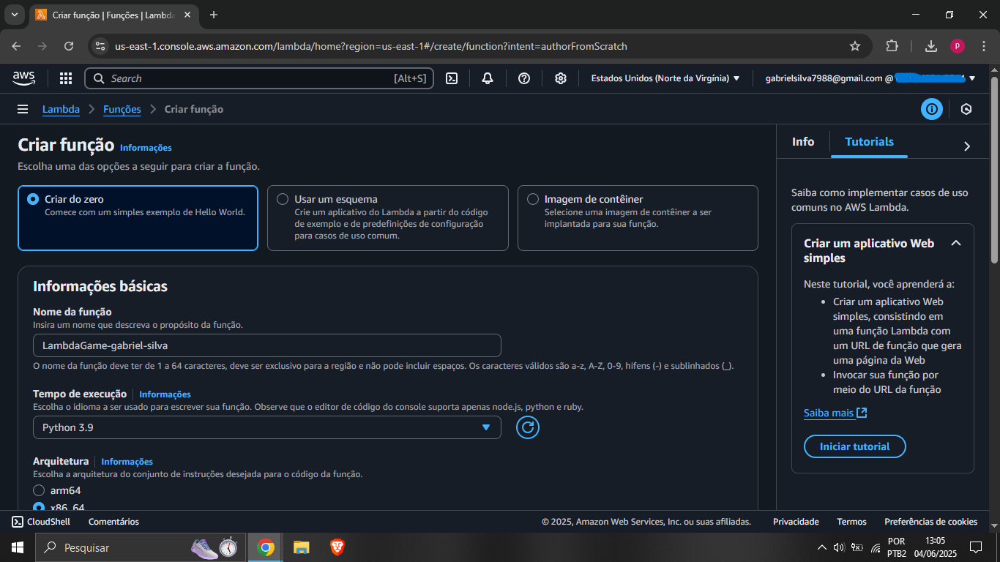
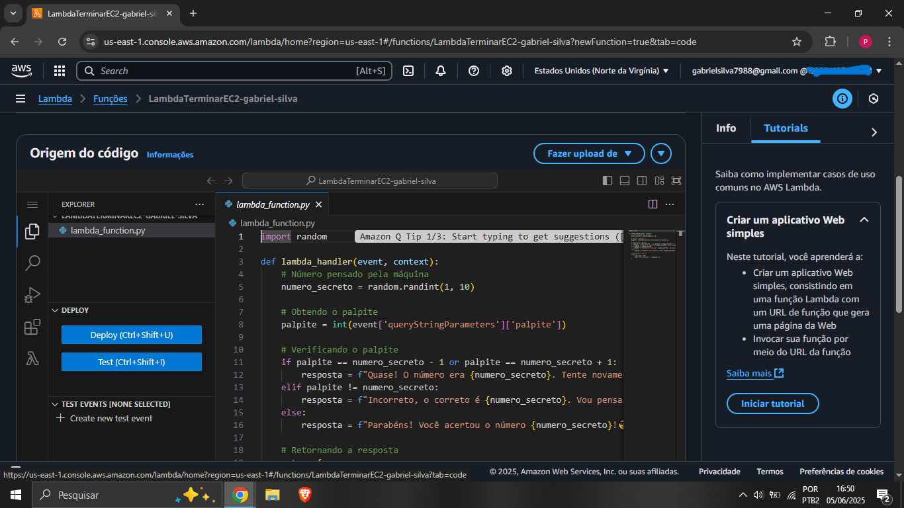
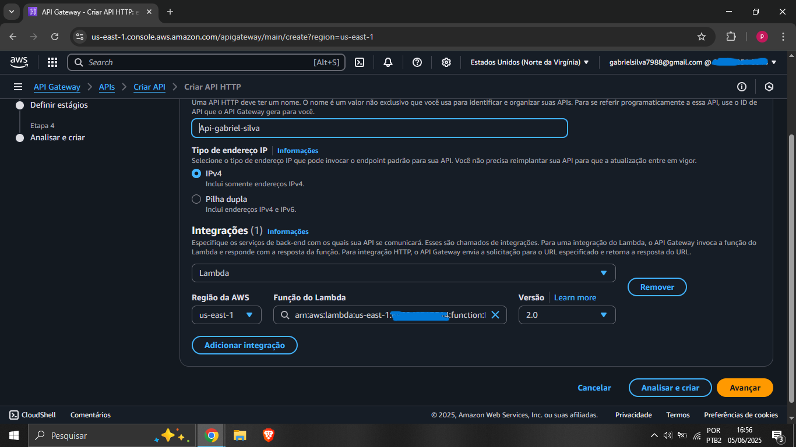
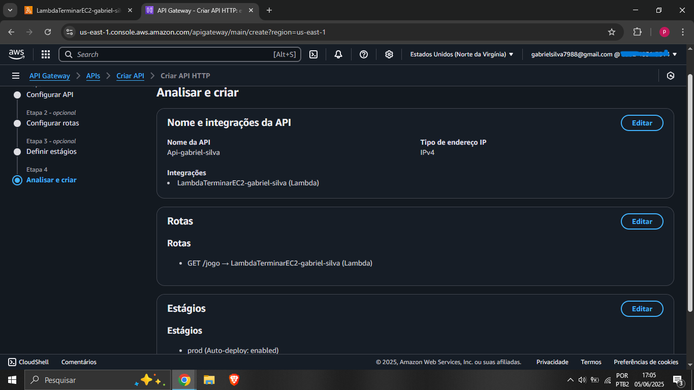
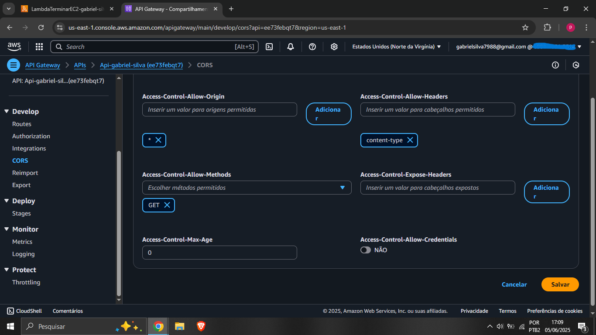
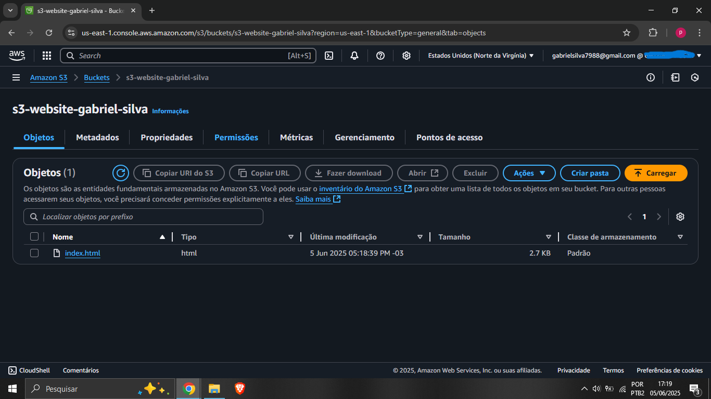
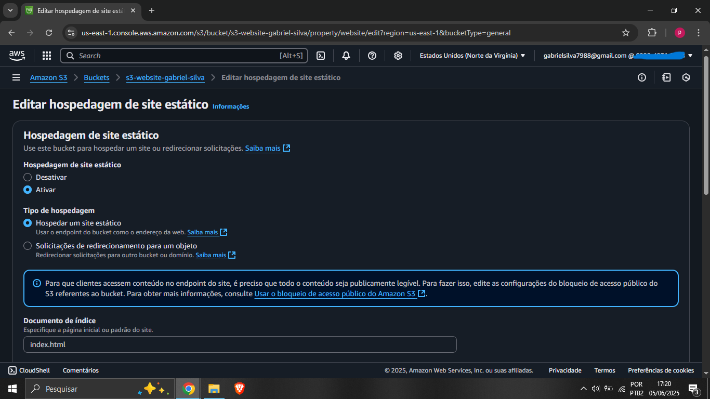
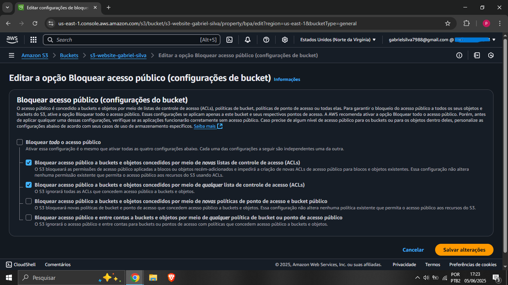
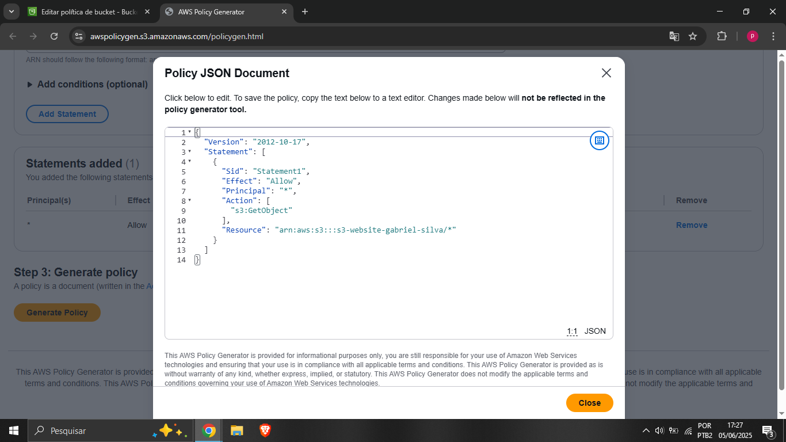
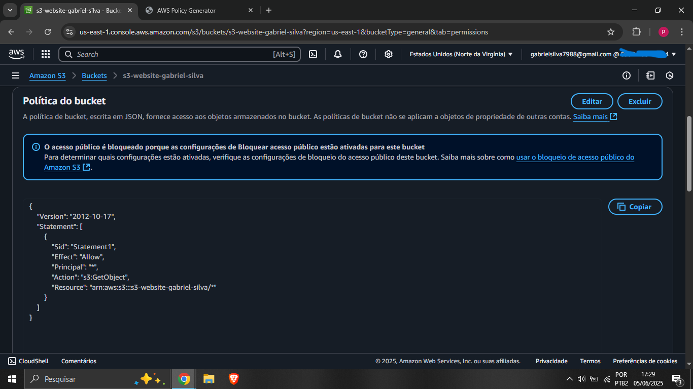
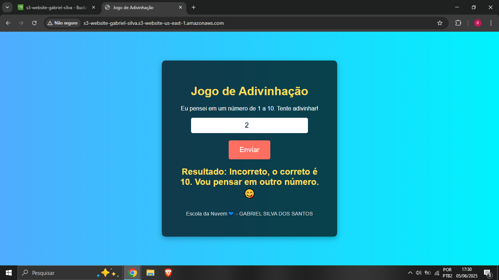
